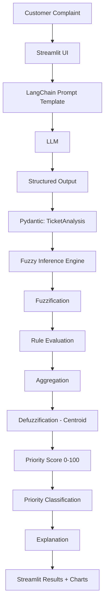

# Architecture

## Overview

SupportAI is a hybrid AI system. An LLM (via LangChain) performs natural
language understanding, and a fuzzy inference system performs the actual
priority decision. The LLM never decides priority directly.

## Module Responsibilities

| Module | Responsibility |
|---|---|
| `app.py` | Streamlit UI, wires everything together |
| `src/models.py` | Pydantic models: `TicketAnalysis`, `PriorityResult` |
| `src/prompts.py` | LangChain prompt template for extraction |
| `src/llm_analyzer.py` | LangChain pipeline: complaint text -> `TicketAnalysis` |
| `src/fuzzy_engine.py` | Mamdani fuzzy inference: `TicketAnalysis` values -> `PriorityResult` |
| `src/config.py` | Centralized secrets and configurable thresholds |
| `src/utils.py` | Input validation helpers |

## Why the LLM and fuzzy logic are separated

The LLM is good at understanding unstructured text but is inconsistent and
opaque as a decision-maker. The fuzzy engine is deterministic, explainable,
and independently testable with fixed numeric inputs (see
`tests/test_fuzzy_engine.py`). This means the priority decision can be
audited and justified without depending on LLM output variability.

## Data Flow

1. User enters a complaint in the Streamlit text area.
2. `src/utils.validate_complaint` rejects empty/too-short input.
3. `src/llm_analyzer.LLMAnalyzer.analyze` sends the complaint through a
   LangChain `ChatPromptTemplate | ChatOpenAI.with_structured_output(...)`
   pipeline, returning a validated `TicketAnalysis`.
4. `src/fuzzy_engine.FuzzyPriorityEngine.analyze` takes the four numeric
   fields (`urgency`, `financial_impact`, `sentiment`, `delay`) and runs
   them through fuzzification, rule evaluation, aggregation, and centroid
   defuzzification to produce a `PriorityResult`.
5. The UI renders extracted values, the priority score/level, a natural
   language explanation, activated fuzzy rules, and a membership function
   chart.
